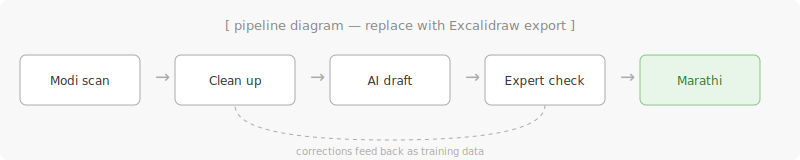

# मोडी ते मराठी · modi-to-marathi

**Turn handwritten Modi-script documents into readable Marathi (Devanagari).**

> I started this project to explore if AI can be effectively used for the
> Transliteration of the Ancient Modi Script.

## Start here

| You want to… | Go to |
|---|---|
| Run it on a Modi image | [`docs/quickstart.md`](docs/quickstart.md) |
| Know where the data comes from | [`docs/data.md`](docs/data.md) |
| Understand the model | [`docs/model.md`](docs/model.md) |

## What this is (and isn't)

It's an **assistive** transliteration pipeline: the model produces a first draft,
a human expert checks and corrects it, and those corrections improve the next
version. It is **not** an autonomous reader — historical records are too important
to trust to an unchecked model.

## Status — Phase 1 complete

A QLoRA fine-tuned model is trained and evaluated. The zero-shot baseline had
a Character Error Rate (CER) of **0.930** — nearly every character wrong.
After fine-tuning on 1,635 real Modi document images, CER dropped to **0.328**:
a 65% reduction.

What that means in practice, across 204 held-out test images:

| Quality tier | CER range | Images | What it means |
|---|---|---|---|
| Perfect | 0.0 | 3 | Ready to accept as-is |
| Excellent | < 0.10 | 5 | Tiny touch-up only |
| Good | 0.10–0.20 | 38 | Minor corrections (1 in 10 chars) |
| **Fair** | **0.20–0.40** | **109** | **Usable first draft — some expert editing** |
| Poor | 0.40–0.70 | 44 | Needs substantial correction |
| Very poor | 0.70–1.0 | 3 | Mostly wrong |
| Hallucination | > 1.0 | 2 | Model looped; discard |

**109 of 204 images (53%) land in the "fair" tier** — a usable first draft that
an expert can correct in less time than transcribing from scratch.
The remaining 46 images in the poor/worse tiers still need heavy work.

Full Phase 1 report: [`docs/phase1-report.md`](docs/phase1-report.md)

## Background & planning

The history of the Modi script, the concept primers, and the project planning docs
live in a separate companion handbook (kept out of this code repo on purpose).

## License

See [`LICENSE`](LICENSE).
